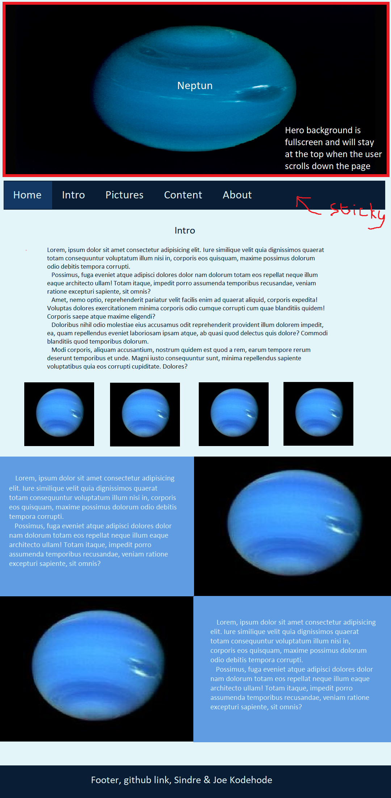

# planeter-prosjekt

## layout
- stort bilete på toppen
- sticky navigasjons bar under bilete
- intro
- hovud innhald
- footer med namn på oss og prosjektet

## notat
- farge-tema: blå
- media-queries for responsiv design
- sans-serif

## fargar
- #E1ECF9 (lightest)
- #609CE1 (ligther)
- #236AB9 (normal blue)
- #133863 (darker)
- #091D34 (darkest)

## font
- Family: [Space Mono](https://fonts.google.com/specimen/Space+Mono)

## oppgåver
- [x] hero bilde (joe)
- [x] navbar, sticky (sindre)
- [ ] navbar, dropdown (sindre)
- [x] bilder galleri (sindre)
- [ ] hovud seksjonen (joe)

## mockup

